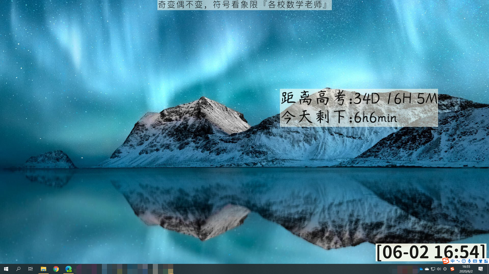

# easy_timer
Just a bit advance timer.

[中文文档](.github_show/chinese_document.md)

It work like this.




```
The landscape picture used for display comes from bing.com .
```


### Partly dependent sources:

> ```
> You can go to these places to download a version to replace the version of this repositorie.
> You can use any font file to replace the fonts that come with us.
> ```
>
> [ffmpeg](https://ffmpeg.org/download.html) [github](https://github.com/ffmpeg/ffmpeg) [LICENSE](https://github.com/FFmpeg/FFmpeg/blob/master/LICENSE.md)
>
> [imagemagick](https://imagemagick.org/index.php)  [github](https://github.com/ImageMagick/ImageMagick) [LICENSE](https://github.com/ImageMagick/ImageMagick/blob/master/LICENSE)
>
> 

```
If there is any infringement, please contact me or submit via issue. I will deal with it as soon as possible.
```


